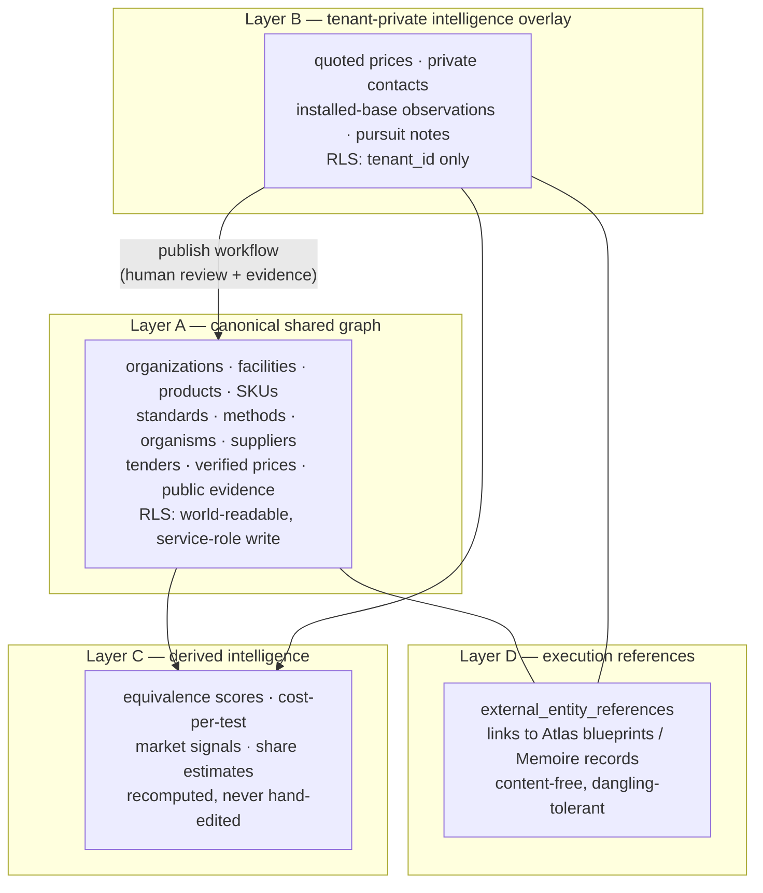

# ADR 0002: Four-Layer Data Model

| | |
|---|---|
| **Status** | Accepted |
| **Date** | 2026-07-27 |
| **Depends on** | ADR 0001 (Supabase/RLS stack) |

## Context

Nexus's core value is a *trusted canonical graph*, but its early users will feed it
*private field intelligence* (quoted prices, contacts, installed-base sightings). Two
failure modes must be structurally prevented:

1. **Private data leaking into the shared graph** — a tenant's negotiated price becoming
   visible to competitors. Unforgivable; kills adoption on day one.
2. **Unverified data masquerading as canonical** — the graph's value collapses if "someone
   said" is indistinguishable from "verified public record".

Neither sister has this problem: Memoire is 100% single-user private; Atlas separates
public reference from user data only as compiler input statuses
(`public-reference | user-supplied | internal-concept | site-evidence-required`). That
Atlas evidence-status vocabulary is the closest existing precedent and informs this design.

## Decision

All Nexus data lives in exactly one of four layers, declared on every row:

- **Layer A — canonical shared graph.** Verified public facts. World-readable; writable
  only by service role through the review pipeline. Every row carries evidence refs and a
  `verification_status` (`verified | provisional | disputed`).
- **Layer B — tenant-private overlay.** One tenant's intelligence: quoted prices, observed
  installed base, contacts-as-market-actors, notes. RLS-isolated per tenant. May *attach
  to* canonical entities (`nexus_entity_id` pointer) but never modifies them.
- **Layer C — derived intelligence.** Computed from A (+ B within the deriving tenant's
  view): equivalence scores, cost-per-test, market signals. Labeled `derived: true`,
  reproducible from inputs, never hand-edited, recomputed on a schedule and on publish.
- **Layer D — execution references.** `external_entity_references` rows pointing at
  Atlas/Memoire objects (see `docs/INTEGRATION_CONTRACTS.md`, Contract C). Content-free,
  one-hop, dangling-tolerant.

### Visibility column discipline

Every table in every layer carries a `visibility` column with CHECK constraint
(`'canonical' | 'tenant'`) plus `tenant_id` (NOT NULL when `visibility='tenant'`, NULL when
`'canonical'`, enforced by CHECK). No row may exist without an explicit visibility — there
is no default, so forgetting to classify is a constraint violation, not a silent leak.
RLS policies key off these columns; policy tests in CI prove that `tenant` rows are
invisible across tenants and `canonical` rows are not writable by tenant roles.

### Publish workflow: tenant-private → canonical

Promotion is the only door, and it is manual:

1. **Request** — a tenant user flags a Layer B row (or derived finding) for publication,
   attaching supporting evidence (public URL, document, tender notice).
2. **Review queue** — a reviewer (data steward role, not the submitting tenant's data)
   checks: Is the fact public? Is the evidence a *public-reference* class source (Atlas
   vocabulary)? Does it deanonymize any tenant?
3. **Anonymization/reshape** — tenant-identifying fields are stripped or generalized
   (e.g. quoted price → public price-band observation with the tenant source removed).
4. **Publish** — service-role write into Layer A with `provenance` recording the review,
   not the tenant. The original Layer B row is unchanged and remains private.
5. **Audit** — every transition recorded append-only (pattern credit: Atlas's append-only
   revisions + Memoire's `import_batches` audit).

Bulk imports (seed datasets, partner feeds) enter through the same queue in batch form —
never direct-to-canonical (pattern credit: Memoire's dry-run-default import CLI).

## Consequences

- Schema design is constrained: every Phase 1 table must declare its layer up front;
  cross-layer FKs are allowed only B→A and C→A (a private row may reference canonical;
  canonical may never reference private).
- Queries serving a tenant view join A + that tenant's B + C; the public market API serves
  A + C only. Both shapes are enforced by RLS, not by query discipline alone.
- Layer C must be regenerable: derivations are code + inputs, so the layer can be rebuilt
  wholesale after a publish batch.
- Rejected alternatives: single-table-with-flags (no structural isolation); separate
  databases per layer (operational overkill at Phase 0, and RLS already gives the
  isolation boundary); automatic publish heuristics (violates the trust model — review is
  the product).
