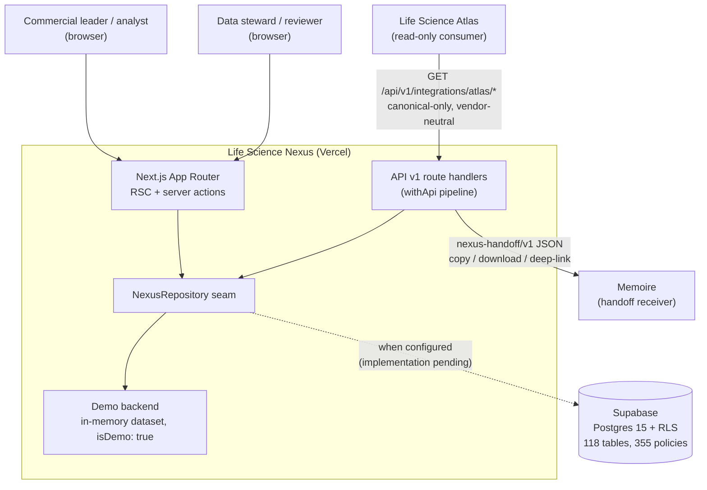
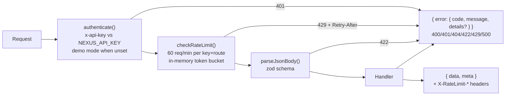

# Architecture — Life Science Nexus

| | |
|---|---|
| **Status** | Current as of v0.1 (founder-testing build) |
| **Date** | 2026-07-28 |
| **Related** | ADR [0001](ADR/0001-technology-stack.md)–[0004](ADR/0004-demo-mode-and-data-policy.md), `docs/DATABASE.md`, `docs/INTEGRATION_CONTRACTS.md` |

Nexus is a Next.js 15 (App Router) application with a single seam — the
`NexusRepository` interface — between the UI/API surface and the data backend.
Two backends implement the seam: an in-memory demo dataset (the runtime today)
and Supabase (schema + RLS shipped, repository implementation pending — see
`docs/KNOWN_LIMITATIONS.md`).

## System context

Hard rules from `docs/ECOSYSTEM_BOUNDARIES.md`: no shared databases, no
cross-product DB foreign keys, data flows **out of Nexus** over versioned
contracts only. Atlas never gets tenant-private or commercial data; Memoire
receives user-initiated handoffs only.

## Four data layers (ADR 0002)

Every row in every layer carries `visibility` (`canonical` | `tenant_private`,
no default) and `is_demo`.

| Layer | Contents | Read | Write |
|---|---|---|---|
| **A — canonical** | Verified public market graph (organizations, products, SKUs, standards, prices, tenders, evidence) | all authenticated users | service role only, via the review/publish pipeline |
| **B — tenant-private** | Quoted prices, contacts, installed-base sightings, notes | tenant members via `is_tenant_member()` | tenant members with owner/admin/analyst role |
| **C — derived** | Equivalence records, cost-per-test, opportunity signals, price benchmarks | A+C shape for API consumers | engines via service role; never hand-edited |
| **D — execution references** | `external_entity_references` → Atlas/Memoire objects (content-free, one-hop, dangling-tolerant) | per visibility | per visibility |

Promotion B → A happens only through the manual publish workflow
(`docs/EVIDENCE_MODEL.md`). Layer C is regenerable: it stores full lineage
(`computed_from`, `triggering_record_ids`, `evidence_claim_ids`).

## Module map

Route groups under `src/app/` map to domain engines under `src/lib/domain/`
through the repository:

| Route group | Routes | Domain engines (`src/lib/domain/`) |
|---|---|---|
| `(core)` | `/dashboard`, `/search` | `search-rank.ts`, `freshness.ts`, `signals.ts` |
| `(market)` | `/organizations`, `/sites`, `/laboratories`, `/people`, `/manufacturers`, `/suppliers`, `/tenders`, `/installed-base`, `/availability` | `matching.ts`, `permissions.ts` |
| `(products)` | `/products`, `/skus`, `/brands`, `/applications`, `/methods`, `/standards`, `/organisms` | `units.ts` |
| `(intelligence)` | `/equivalence`, `/matching`, `/compare`, `/cost-per-test`, `/prices`, `/signals` | `equivalence.ts`, `cost-per-test.ts`, `price-normalization.ts`, `signals.ts` |
| `(research)` | `/research`, `/evidence`, `/sources`, `/review` | `confidence.ts`, `freshness.ts` |
| `(ops)` | `/imports`, `/exports`, `/admin/data-quality`, `/admin/entity-resolution` | `entity-resolution.ts`, `export.ts`, `src/lib/imports/` |
| `(settings)` | `/settings`, `/settings/integrations` | `src/lib/integrations/` |
| `api/v1` | REST surface + `integrations/atlas/*`, `integrations/memoire/handoff`, `openapi.json` | `src/lib/api/` |

Domain model: 79 entity types in `src/lib/domain/types.ts` (single source of
truth; DB columns are snake_case mirrors).

## Request flow

**Page render (read path).** Server component → `getRepository()`
(`src/lib/data/index.ts`) → active backend → props into client components.
Route-group layouts pass the backend identity down so the UI chrome shows the
"Demo workspace" vs "Supabase" badge (`src/components/data-mode-badge.tsx`).

**Mutations.** Server actions (e.g. `src/app/(ops)/imports/actions.ts`) →
repository write methods (`createEntity` / `updateEntity` / `archiveEntity` —
soft delete via `archivedAt`). The demo backend persists in-process only.

**API v1 pipeline.** Every v1 route wraps its handler in `withApi(routeKey,
handler)` (`src/lib/api/handler.ts`):

Tenant scoping on the API: the `x-nexus-tenant` header selects the tenant the
caller acts as; without it the caller is anonymous and sees canonical data
only (`src/lib/api/auth.ts`).

## Backend selection

`src/lib/env.ts` (zod-validated, never throws) resolves the backend:

- `NEXUS_DATA_BACKEND=supabase|demo` forces a backend;
- otherwise auto-detect: `NEXT_PUBLIC_SUPABASE_URL` +
  `NEXT_PUBLIC_SUPABASE_ANON_KEY` present → `supabase`, else `demo`;
- the demo backend is `src/lib/data/demo-repository.ts` over the 985-record
  synthetic dataset in `src/lib/demo/` (tenant `tenant_demo`; deliberate
  `tenant_other` records prove isolation);
- `src/lib/data/supabase-repository.ts` currently **throws loudly** —
  fail-closed so a misconfigured deployment never serves an empty database as
  if it were real data. The 10 migrations under `supabase/migrations/` are
  ready for it (see `docs/DATABASE.md`).

## Deployment shape

Single Next.js deployment on Vercel; Supabase project (hosted or local via
`supabase/config.toml`) as the only stateful dependency. Security headers are
set in `next.config.ts`; CI (`.github/workflows/ci.yml`) runs
typecheck/lint/vitest/build on every PR, with a Supabase E2E job gated on the
`SUPABASE_E2E_ENABLED` repo variable. See `docs/DEPLOYMENT.md`.
