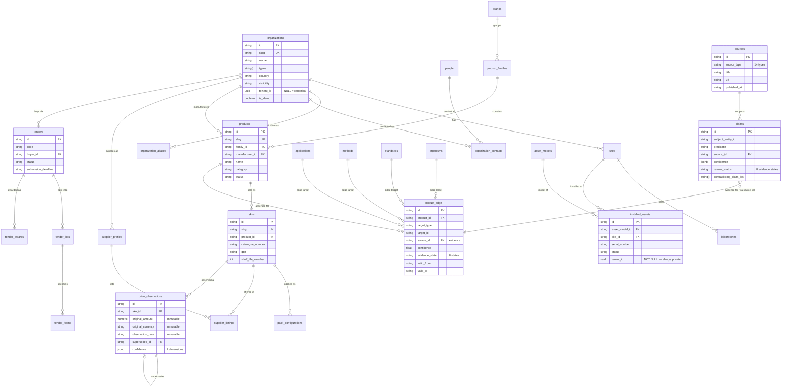

# Data Model — Life Science Nexus

| | |
|---|---|
| **Status** | Canonical reference for the entity model |
| **Date** | 2026-07-28 |
| **Sources of truth** | `src/lib/domain/types.ts` (79 entity types, TS) · `supabase/migrations/` (118 tables, SQL mirrors) |

The TypeScript types in `src/lib/domain/types.ts` are the single source of
truth. Database columns are snake_case mirrors; zod DTOs
(`src/lib/domain/schemas.ts`) derive from the same const-array enums. This
document describes the model conceptually — for table-level detail see
`docs/DATABASE.md`.

## Conventions

- **Ids.** `nexus_<type>_<ulid>`-style stable ids in the domain layer
  (`src/lib/domain/id.ts`); `uuid pk default gen_random_uuid()` in SQL.
- **Slugs as secondary ids.** `organizations`, `products`, `skus`,
  `standards` carry a unique `slug` for human-readable URLs. Ids are
  permanent; slugs may be corrected.
- **Base columns.** Every entity: `createdAt`/`updatedAt`,
  `createdBy`/`updatedBy`, `visibility` (`canonical` | `tenant_private` — no
  default; omitting it is a constraint violation), `isDemo`, `archivedAt`
  (soft delete). Canonical-capable tables add a nullable `tenantId` with the
  layer CHECK: canonical ⇒ `tenant_id IS NULL`, tenant_private ⇒ NOT NULL.
- **Tenant-scoped types** (`TENANT_SCOPED_ENTITY_TYPES`: people, contacts,
  installed assets, research workspace, import/audit records, …) always have
  `tenant_id NOT NULL`. `people`, `organization_contacts`,
  `contact_observations` additionally have `CHECK (visibility =
  'tenant_private')` — PII can never become canonical.
- **Money** is `{ amount, currency }` (ISO 4217); engines never convert
  currency without an explicit `ExchangeRateSnapshot`. Dates are ISO 8601;
  countries ISO 3166-1 alpha-2.

## Entity families

**Evidence & provenance.** `source` (14 `SOURCE_TYPES`, from
`manufacturer_catalogue` to `field_observation`) with `source_document`
snapshots; `claim` — a structured assertion
`{subject, predicate, object, sourceId, confidence (7 dimensions),
reviewStatus (8 states), validFrom/validTo, reviewerId,
contradictingClaimIds}`; `evidence_review`, `data_quality_issue`,
`audit_log_entry`. See `docs/EVIDENCE_MODEL.md`.

**Organizations & people.** `organization` (types array: manufacturer,
distributor, hospital, pharmaceutical_company, …; identifiers:
tax_code/DUNS/GMP/ISO certs) + `organization_alias`,
`organization_relationship`; `site` → `facility_unit` / `laboratory` /
`production_line`; `address`, `geography`; `person` +
`employment_relationship`, `organization_contact` (always tenant-private).

**Products.** `brand` → `product_family` → `product` (category enum, status)
→ `sku` (catalogue number, GTIN, shelf life, storage) → `pack_configuration`
/ `product_format`; `product_document`. Scientific reference:
`application`, `method`, `standard` + `standard_version`, `organism`,
`sample_type`, `industry`, `technology`, `test_type`,
`incubation_condition`, `preparation_method`.

**Product edges.** `product_edge` rows connect products/SKUs to applications,
methods, standards, organisms, sample types, etc. Edges are
**evidence-carrying**: each carries flattened `EdgeEvidence` (`source_id`,
`confidence` 0–1, `valid_from`/`valid_to`, `reviewer_id`, `notes`,
`evidence_state` — an 8-state CHECK mirroring `EVIDENCE_STATES`). The graph
asserts nothing without a source.

**Suppliers & prices.** `supplier_profile` (relationship type: authorized
distributor … unknown_unverified), `distribution_agreement`,
`supplier_listing`, `availability_observation`, `commercial_terms`.
`price_observation` is an **immutable ledger**: no DELETE policy; a trigger
forbids updating `original_amount`/`original_currency`/`observation_date`;
corrections are new rows linked by `supersedesId` (the old row's evidence
state becomes `superseded`). `price_component` (tax/VAT breakdown),
`price_benchmark` (derived, Layer C).

**Tenders.** `tender` → `tender_lot` → `tender_item`; `tender_bidder`,
`tender_award`, `tender_event`, tender documents. Status: published /
closed / awarded / cancelled / unknown.

**Installed base.** `asset_model`; `installed_asset` (tenant-private:
site/lab, serial, installation date, status, qualification status,
confidence) + `asset_lifecycle_event`, `maintenance_event`,
`qualification_event`, `consumable_compatibility`, `consumption_model`,
`replacement_assumption`.

**Validation & research.** `vendor_approval`, `product_validation`,
`trial_event`; research workspace (`research_project`, `research_note`,
`research_finding`, `research_project_entity`, `saved_view`,
`research_export`) and `cost_per_test_scenario` — all tenant-private.

**Derived & ops (Layer C/D).** `equivalence_record`, `opportunity_signal`,
`duplicate_candidate`, `entity_merge_event`, `external_entity_reference`,
`outbound_handoff_record`, import staging, plus tenancy (`tenant`,
`tenant_membership`, `profile`).

## Core graph (ER)

Simplified — ~25 of 118 tables. Edge/relationship tables carry the flattened
`EdgeEvidence` columns shown once on `product_edge`.

The full schema — 118 tables including availability, validation, research,
derived-intelligence, import-staging, and tenancy tables — is in
`supabase/migrations/` (table inventory per migration: `docs/DATABASE.md`).

## Relationship rules

- Cross-layer FKs only **B→A and C→A**: a tenant-private row may point at a
  canonical entity; canonical rows never reference private ones (ADR 0002).
- Layer C rows carry lineage (`computed_from`, `triggering_record_ids`,
  `evidence_claim_ids`) and are rebuilt by engines, never edited by hand.
- `external_entity_references` (Layer D) stores opaque ids/URLs to
  Atlas/Memoire objects — never DB FKs, never content copies (Contract C,
  `docs/INTEGRATION_CONTRACTS.md`).
