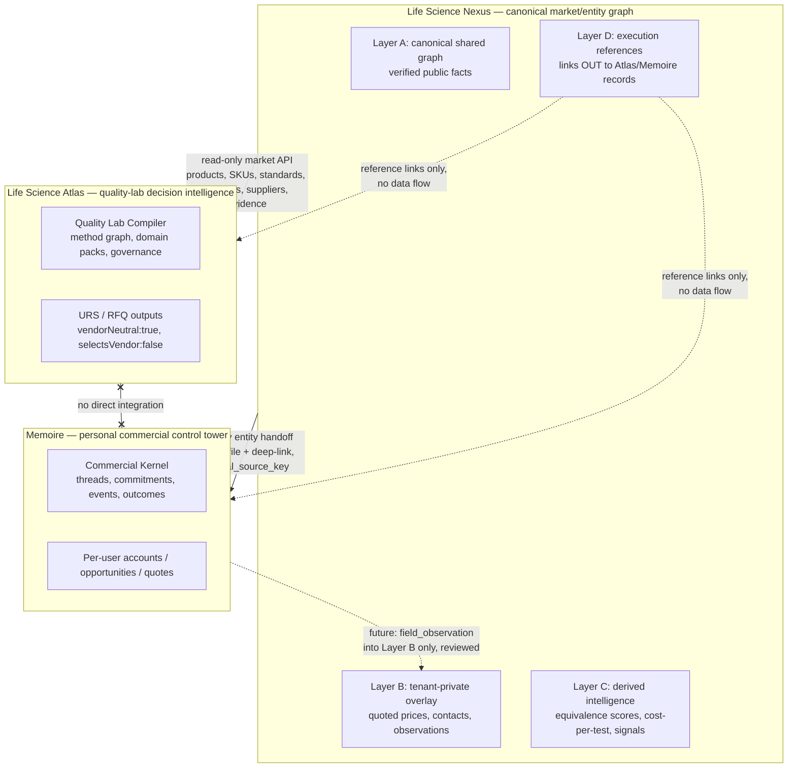

# Ecosystem Boundaries — Nexus / Atlas / Memoire

| | |
|---|---|
| **Status** | Normative for Phase 0+ |
| **Date** | 2026-07-27 |
| **Derived from** | `docs/PREFLIGHT_AUDIT.md` |

Three products, three jobs. Each product has a clear *owns* list and an explicit
*must-not-become* list. Boundary disputes are resolved by this document, then by the
entity matrix (`docs/ENTITY_OWNERSHIP_MATRIX.md`), then by an ADR.

## The one-sentence split

- **Life Science Nexus** owns **canonical market and entity truth** — the verified,
  shared graph of the life-science market (organizations, facilities, products, SKUs,
  standards, suppliers, prices, tenders, installed base, evidence).
- **Life Science Atlas** owns **quality-lab decision intelligence** — compiling lab
  requirements into vendor-neutral blueprints, methods, and governance.
- **Memoire** owns **personal commercial execution** — one user's accounts, opportunities,
  commitments, threads, and money follow-up.

Nexus answers *"what exists in the market and what is true about it?"*
Atlas answers *"what should this laboratory be and how do we defend that decision?"*
Memoire answers *"what do I do next on my deals, and what did it earn me?"*

## Boundary diagram

Hard rules implied by the diagram:

- There is **no Atlas ↔ Memoire integration** and none is planned.
- Data flows **out of Nexus** or **into Nexus Layer B**; Nexus never pulls from Atlas or
  Memoire private stores.
- Layer D holds *references* (URLs/ids) to Atlas/Memoire records, never copies of their
  private data.

## Life Science Nexus

**Owns:** organizations, facilities, laboratories, people (as market actors, e.g. published
authors, listed QA managers), manufacturers, brands, products, SKUs, applications,
methods (as market entities), standards, organisms, suppliers, market prices, tenders,
installed-base assets, validation status, market evidence, derived market intelligence
(equivalence scores, cost-per-test, signals), tenant-private intelligence overlays.

**Must NOT become:**

- ❌ **A CRM.** No pipeline stages, no forecast, no activity logging against deals, no
  "my accounts" state. That is Memoire's job. Nexus knows an organization *exists* and what
  is true about it; it does not track *your relationship* with it.
- ❌ **A lab-planning tool.** No lab blueprints, capacity models, layout, staffing, or
  method-selection compilers. That is Atlas's job. Nexus knows which methods/standards
  exist and which products map to them; it does not design a lab.
- ❌ **A quoting/order tool.** Nexus records *observed* market prices and price evidence;
  it does not issue quotes, take orders, or manage PO/delivery/payment state.
- ❌ **A content academy.** Standards/method pages are reference data, not courses.
- ❌ **A messaging or capture surface** for raw commercial conversations.
- ❌ **A vendor-recommendation engine presented as neutral lab guidance.** Nexus computes
  market-facing equivalence scores; it must not emit URS/RFQ-style "recommended
  configuration" outputs — that would collide with Atlas's contractual vendor neutrality.
- ❌ **A shared database for Atlas or Memoire.** Neither sister may mount Nexus tables;
  access is API-only (see `docs/INTEGRATION_CONTRACTS.md`).

## Life Science Atlas

**Owns:** the Quality Lab Compiler, method graph and domain packs, evidence records for lab
decisions, decision lineage, governance/calibration chain, URS/RFQ commercial-handoff
outputs, Academy and career content, its own engagement pipeline (`quote_requests`), its
own product catalog and billing (`server/products.ts` + Stripe).

**Must NOT become:**

- ❌ **A market entity graph.** No organization master data beyond free-text
  `companyName`; no supplier entities (RFQ stays `Supplier A/B/C` slots); no SKU catalog
  of the market; no tender database; no installed-base registry.
- ❌ **A CRM beyond its own engagements.** `quote_requests` (`server/admin.ts:33-44`) is
  scoped to Atlas's diagnostic engagements and must not grow into account management.
- ❌ **A market price source.** CAPEX bands on `EquipmentRecommendation` stay concept-level;
  real market prices come from Nexus's read-only API, clearly attributed, and must never be
  presented as Atlas's vendor selection (the `selectsVendor:false`,
  `assertsProductEquivalence:false` literals are contractual).
- ❌ **A host for Nexus tables.** Atlas has no RLS; a shared DB would bypass its
  Express-level authorization. Explicitly forbidden.

## Memoire

**Owns:** the Commercial Kernel (threads, commitments, events, value outcomes), per-user
accounts/contacts/stakeholders, opportunities, header-level quotes, sales activities and
personal-scope signals, captures, import/export pipeline, its own billing and analytics.

**Must NOT become:**

- ❌ **A canonical entity store.** Memoire `accounts` remain per-user private copies keyed
  by name (`UNIQUE(user_id,name)`); they are never promoted to shared truth. Canonical
  org data flows in from Nexus via `external_source_key`, not the reverse.
- ❌ **A product/SKU/price catalog.** `product_or_solution`/`brand`/`channel` stay free
  text; structured equivalents are resolved by linking to Nexus entities.
- ❌ **A multi-user or team workspace.** The single-user-per-account RLS model is
  deliberate (documented in Memoire's CommercialScope); Nexus must not require shared
  reads from Memoire.
- ❌ **An AI pipeline.** The no-AI boundary is contract-test-enforced
  (`scripts/verify-no-ai-dependency.mjs`). Nexus integrations must not push
  AI-generated content into Memoire on the user's behalf without explicit user action.
- ❌ **A market-signal aggregator.** Personal signals in `sales_activities` jsonb stay
  personal; aggregation into market intelligence happens only via the future
  `field_observation` return path into Nexus Layer B, under review.

## Boundary enforcement

- Each cross-product flow is a versioned contract in `docs/INTEGRATION_CONTRACTS.md` with
  Zod schemas and mock-first contract tests (pattern credits: Atlas's versioned
  `quality-lab-*/v1` contracts, Memoire's `verify-*.mjs` build gates).
- Nexus adds its own contract test (`scripts/verify-boundaries.*`) asserting: no CRM-shaped
  columns (stage/forecast/probability) on canonical org tables; no Atlas-record copies in
  Layer D (references only); no canonical row without a `visibility` value.
- When a proposed feature needs data another product owns, the default answer is a
  reference or an API call — never a local copy. Exceptions require an ADR amending this
  document.
