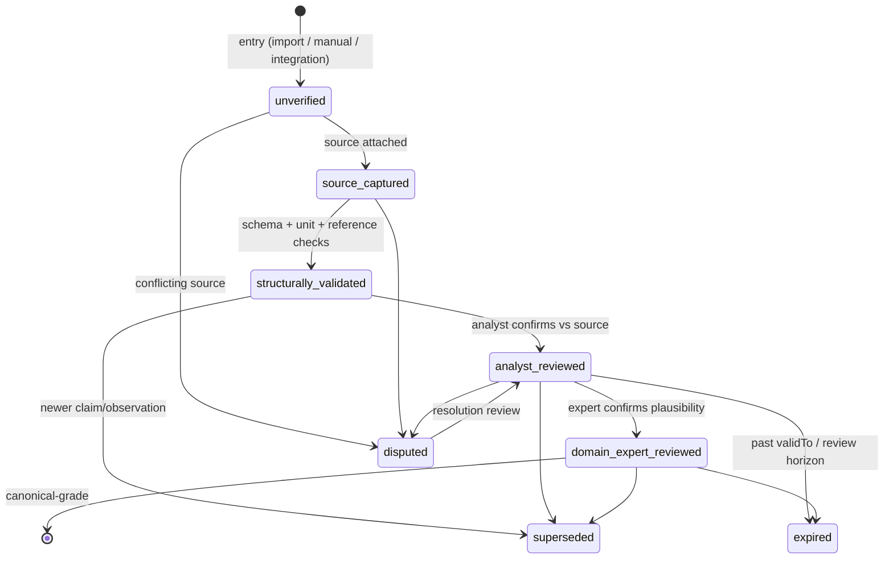

# Evidence Model — Life Science Nexus

| | |
|---|---|
| **Status** | Normative for anything that asserts a fact in the graph |
| **Date** | 2026-07-28 |
| **Sources of truth** | `src/lib/domain/types.ts` (`EVIDENCE_STATES`, `SOURCE_TYPES`, `Claim`, `ConfidenceDimensions`) · `src/lib/domain/confidence.ts` · `src/lib/domain/freshness.ts` |

Nexus's core promise is that *canonical means verified*. The evidence model is
how that promise is kept: every assertion is a claim with a source, a
multi-dimensional confidence, and a review state — never a bare fact.

## Evidence states (8)

`EVIDENCE_STATES` in `src/lib/domain/types.ts:34`:

| State | Meaning |
|---|---|
| `unverified` | Entered (import, manual, integration) with no supporting source check yet |
| `source_captured` | A source record exists and is attached |
| `structurally_validated` | Claim shape, references, units and dates validated |
| `analyst_reviewed` | A human analyst confirmed the claim matches its source |
| `domain_expert_reviewed` | A domain expert confirmed real-world plausibility (highest bar) |
| `superseded` | Replaced by a newer claim/observation (side state, terminal for the old row) |
| `disputed` | Two or more sources disagree; `contradictingClaimIds` link the conflict both ways |
| `expired` | Past its `validTo` / review-by horizon; excluded from current-truth views |

`confidence.ts` provides `evidenceStateRank()` and `meetsReviewBar()` so
filters can say "at least analyst-reviewed" without hard-coding the order.

## Confidence dimensions (7)

`ConfidenceDimensions` — each 0–1, stored as `jsonb` on `claims.confidence`
and `price_observations.confidence`. Kept as dimensions (not one score) so
the UI can explain *why* something is trusted; `aggregateConfidence()`
collapses them when a single number is needed.

| Dimension | Question it answers |
|---|---|
| `sourceAuthority` | Manufacturer document > distributor quote > conversation |
| `sourceRecency` | How fresh is the underlying evidence |
| `entityMatch` | Is the claim attached to the right entity |
| `extraction` | Reliability of transcription/extraction into the system |
| `technicalEquivalence` | Technical certainty (product-equivalence claims) |
| `geographicRelevance` | Evidence geography vs market of interest |
| `commercialRelevance` | Relevance to the commercial question at hand |

## Claim structure

`Claim` (`src/lib/domain/types.ts:242`):

| Field | Role |
|---|---|
| `subjectEntityType` / `subjectEntityId` | What the claim is about |
| `predicate` | e.g. `distributed_by`, `conforms_to_standard`, `has_price` |
| `objectValue` | The asserted value (`ClaimObjectValue`) |
| `sourceId` | The supporting `Source` — mandatory |
| `effectiveDate` | When the claim became true in the real world |
| `reviewByDate` | Past due → the claim appears in the review queue |
| `confidence` | The 7 dimensions above |
| `reviewStatus` | One of the 8 evidence states |
| `reviewerId` | Last reviewer |
| `contradictingClaimIds` | Disagreeing claims, linked both directions |

Sources are typed (`SOURCE_TYPES`, 14 values: `manufacturer_catalogue`,
`manufacturer_website`, `regulatory_document`, `standard`,
`tender_document`, `public_company_document`, `distributor_quotation`,
`customer_quotation`, `import_record`, `customer_conversation`,
`field_observation`, `internal_note`, `user_uploaded_document`,
`public_web_source`) with `source_document` snapshots so the reviewed
artifact survives upstream changes.

Lightweight edges (product edges, relationships, listings, awards) carry a
flattened `EdgeEvidence` (`source_id`, `confidence` 0–1, `valid_from/to`,
`reviewer_id`, `notes`, `evidence_state`) instead of a full claim; promote
to a claim when dimensional confidence matters.

## Evidence lifecycle

Every transition is recorded as an `evidence_review` row
(`{claimId, reviewerId, fromState, toState, comment, reviewedAt}`) —
append-only history, auditable per claim.

## Review workflow (`/review`)

The review queue (`src/app/(research)/review/page.tsx` +
`src/components/evidence/review-queue.tsx`) lists claims in the queue states
`unverified` and `source_captured`, plus claims past their `reviewByDate`
(`isReviewDue()` / `daysUntilReviewDue()` in `freshness.ts`). A reviewer
advances the state and leaves a comment; the transition writes an
`evidence_review`. On Supabase, writes to review tables require the
`owner`/`admin`/`reviewer` tenant role (RLS group 2, `docs/SECURITY_MODEL.md`).

## Publish workflow: tenant-private → canonical

The only door from Layer B to Layer A (ADR 0002), all manual:

1. **Request** — a tenant user flags a private row for publication with
   public-reference evidence attached.
2. **Review** — a data steward (not the submitting tenant) checks: is the
   fact public, is the evidence public-reference class, does it deanonymize
   anyone.
3. **Anonymize/reshape** — tenant-identifying fields stripped or generalized
   (quoted price → public price band with the tenant source removed).
4. **Publish** — service-role write into Layer A; `provenance` records the
   review, not the tenant. The original Layer B row stays private.
5. **Audit** — every transition in the append-only `audit_log`.

Bulk imports enter the same queue in batch form — never direct-to-canonical.

## Contradiction handling

Disagreement is data, not an error: both claims stay, `reviewStatus =
disputed`, and `contradictingClaimIds` links them in both directions so the
UI can show the conflict side by side. Resolution is a review action that
moves one claim forward and typically `superseded`s the other; price
corrections specifically go through the immutable-observation +
`supersedesId` mechanism (`docs/DATA_MODEL.md`).

## Freshness

`freshness.ts` buckets evidence age: `aging` after 90 days, `stale` after
180 days (defaults; `PRICE_STALE_AFTER_DAYS = 180` in `signals.ts` drives the
`price_stale` opportunity signal). Stale ≠ deleted: stale rows stay visible
with their age shown; the signal queue and the data-quality dashboard surface
them for re-sourcing (`docs/OPERATIONS_RUNBOOK.md`).
