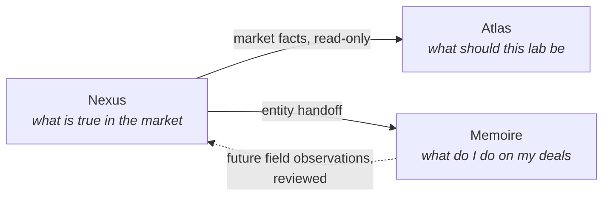

# Positioning — Life Science Nexus

| | |
|---|---|
| **Status** | Phase 0 positioning statement |
| **Date** | 2026-07-27 |
| **Companion** | `docs/PRODUCT_SCOPE.md`, `docs/ECOSYSTEM_BOUNDARIES.md` |

## Positioning statement

**For** commercial and technical teams in life-science markets, **Life Science Nexus is**
the industry and product intelligence graph that turns scattered market knowledge — who
makes what, who buys what, which standards apply, what's installed where, at what observed
prices — **into** a verified, queryable, evidence-backed graph. **Unlike** CRMs, it records
market truth rather than your pipeline; **unlike** lab-planning tools, it describes the
market rather than designing your lab; **unlike** raw web research, every fact carries
evidence and a verification status.

## Category and role in the ecosystem

Nexus creates and owns a new layer in the product family: **canonical market/entity data**.

- **Atlas** = quality-lab decision intelligence (vendor-neutral by contract).
- **Memoire** = personal commercial control tower (single-user, private by design).
- **Nexus** = the shared factual substrate both can draw on — without becoming either.

## Differentiators

1. **Evidence-backed canonical data.** Every canonical fact links to public-reference
   evidence and carries `verified | provisional | disputed`. The publish review workflow
   (ADR 0002) is the trust mechanism, not a claim.
2. **Four-layer honesty.** Public truth, private overlay, derived intelligence, and
   execution references are structurally separated (visibility column + RLS), so a quoted
   price never masquerades as a market fact and a derived score never masquerades as raw
   data.
3. **Structured where the alternatives are free text.** Sisters and competitors keep
   products/suppliers as notes fields (Memoire's `product_or_solution`; Atlas's
   `Supplier A/B/C` slots). Nexus gives these entities stable ids and graph relationships.
4. **Ecosystem-native.** Designed from day one to hand entities into Memoire and serve
   Atlas read-only — documented contracts, not aspirational integrations.
5. **Wedge-first, configurable.** Industrial microbiology in Vietnam as the proving
   ground; geography and vertical are configuration, so the model transfers to the next
   market without re-architecture.

## What Nexus deliberately concedes

Positioning is as much about what we decline:

- **Deal execution** → Memoire. Nexus will never be where you manage a pipeline.
- **Lab design decisions** → Atlas. Nexus will never tell a lab which configuration to
  build, and never presents market data as vendor-neutral lab guidance.
- **Education** → Atlas Academy. Nexus reference pages inform; they do not teach courses.
- **Breadth over depth at launch** → declined. One vertical, one geography, high
  completeness beats shallow global coverage.

## Message discipline (engineering translation)

When in doubt about a feature, apply the litmus test: *does it add or serve a verified
market fact, a tenant's private overlay on one, a labeled derivation, or a reference to
where work happens?* If it instead tracks a relationship, designs a lab, or closes a deal,
it belongs to a sister product — route it there via `docs/INTEGRATION_CONTRACTS.md`.
