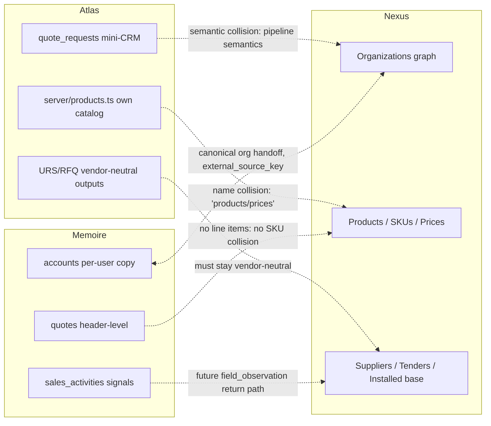

# Phase 0 Preflight Audit — Sister-Product Reconnaissance

| | |
|---|---|
| **Status** | Complete — input to Phase 0 architecture decisions |
| **Date** | 2026-07-27 |
| **Scope** | Life Science Atlas (repo `Bio-Wiki-Pro-Claude`, cloned read-only at `.audit/atlas`) and Memoire (repo `memoire`, cloned read-only at `.audit/memoire`) |
| **Feeds** | `docs/ECOSYSTEM_BOUNDARIES.md`, `docs/ENTITY_OWNERSHIP_MATRIX.md`, `docs/INTEGRATION_CONTRACTS.md`, `docs/ADR/0001`–`0004` |

## 0. Purpose and method

Life Science Nexus will operate between two live sister products. Before any Nexus schema
or integration surface is designed, this audit establishes, from source:

1. What each product actually is today (stack, auth, data model, design system).
2. Where Nexus would collide with them (entity overlap, semantic overlap, operational risk).
3. What can be reused as a *pattern* (never as shared code or shared tables).
4. Which components must remain independent for legal, trust, or moat reasons.
5. The integration contracts that are safe to build against each product as it exists today.

Method: static inspection of both clones. Every claim below cites a repo path. Neither repo
contains any reference to the other product or to Nexus (grep-verified), so all integration
is greenfield.

---

## Part 1 — Life Science Atlas (`Bio-Wiki-Pro-Claude` → `.audit/atlas`)

### 1.1 What it is

A quality-lab decision-intelligence product. Its core is the "Atlas Quality Lab Compiler":
~40 test-backed modules in `shared/quality-lab-*.ts` that compile versioned inputs
(`quality-lab-input/v1`) into lab blueprints (`quality-lab-blueprint/v1`) with full
decision lineage (`quality-lab-lineage/v1`, `RuleTrace`, `DecisionLineage`). It also ships
an MDX Academy (79 entries in `content/academy`, 119 in `content/blog`) and career
blueprints. Positioning is contractually vendor-neutral — see `docs/PRODUCT_SOURCE_OF_TRUTH.md`
(Evidence / Intelligence / Commercial Outputs three-layer model).

### 1.2 Tech stack

| Layer | Choice | Version / location |
|---|---|---|
| Frontend | React SPA, Vite, TypeScript | React 18.3.1, Vite 7, TS 5.6.3 |
| Server | Express on Vercel serverless | Express 5, whole app wrapped in `api/index.ts` |
| Shared domain | TS package shared client/server | `shared/` |
| Routing | Wouter | — |
| UI | Tailwind 3 + shadcn/ui "new-york" on Radix | ~30 Radix packages, 46 components in `client/src/components/ui`, `components.json` |
| Animation / misc | framer-motion, cmdk, lucide-react | — |
| State | TanStack Query 5 + React Context + localStorage (local-first) | `client/src/hooks/use-auth.ts`, `context/UserContext.tsx` |
| Forms | react-hook-form + zod 3 + drizzle-zod | — |
| Exports | pdfkit, docx, xlsx, recharts | — |
| Billing / email | Stripe, Resend | webhook idempotency via `processed_stripe_events` |
| Tests | Vitest 4, supertest, Playwright | validation gate `npm run validate` |
| Build / deploy | custom `script/build.ts`, Vercel, one cron | `CRON_SECRET` |

### 1.3 Auth

Custom session-cookie auth, not Supabase:

- bcryptjs email/password; `express-session` persisted in Postgres via `connect-pg-simple`
  (`sessions` table, 7-day TTL, httpOnly).
- Optional Google ID-token sign-in.
- `isAuthenticated` middleware reads `req.session.userId`.
- No role table. Entitlement = `isPro` boolean (Stripe) + `isAdmin` from `ADMIN_EMAILS`
  env allowlist; pure entitlement function at `server/entitlements.ts`.
- Rate limiting via `express-rate-limit`, in-memory per instance.

### 1.4 Database

Plain Postgres over `pg` Pool + Drizzle ORM 0.39.3. **No Supabase, no RLS** — all
authorization is application-level inside Express. `server/db.ts` accepts
`DATABASE_URL`/`POSTGRES_URL*`. Schema lives in `shared/schema.ts` and
`shared/models/auth.ts`; workflow is `drizzle db:push` with only
`migrations/0000_baseline.sql` as a baseline.

Tables of note: `users` (identity, tokens, Stripe, `isPro`), `sessions`, `purchases`,
`processed_stripe_events`, `leads`, `quote_requests` (inbound service pipeline
`new → qualified → diagnostic-paid → … → won → lost`, administered at
`server/admin.ts:33-44` — Atlas's own engagement-scoped mini-CRM), `content_entries`,
`lesson_reads`, `atlas_pro_monthly_reviews`, `career_blueprint_executions/profiles`,
`nurture_sends`/`lifecycle_sends`/`checkout_attempts`,
`quality_lab_reviewed_projects(+revisions)`, `quality_lab_governance_records(+revisions)`.

**Absent:** organizations/accounts/tenants, product/SKU catalog, market prices, suppliers,
tenders, installed base. `companyName` is free text.

### 1.5 Design system

shadcn/ui "new-york" with CSS variables; dark scientific HSL palette; Inter + Space Grotesk.
PWA shell in `client/src/App.tsx` (DesktopNav / MobileHeader / BottomNav / CommandPalette).
70+ pages in `client/src/pages`, ~30 under `/quality-lab/*`; features grouped in
`client/src/features/{academy,compliance,tools,vault,career}`.

### 1.6 Entity model (as it relates to Nexus)

- `EvidenceRecord` with kinds `regulatory-context | project-input | benchmark |
  site-document` and statuses `public-reference | user-supplied | internal-concept |
  site-evidence-required` — the closest existing concept to Nexus "market evidence".
- Method graph + microbiology domain pack (methods, organisms, applications as *compiler
  domain content*, not as market entities).
- `EquipmentRecommendation` carries concept CAPEX bands (not prices).
- Commercial-handoff contract URS/RFQ v1 with Zod literals
  `vendorNeutral: true`, `selectsVendor: false`, `assertsProductEquivalence: false`.
- RFQ workbook generation uses supplier-neutral `Supplier A/B/C` slots — no supplier entity.

### 1.7 Overlap risks with Nexus

1. **`quote_requests` mini-CRM + admin pipeline UI.** Scoped to Atlas's own engagements,
   but it is a CRM-shaped table. Nexus must not build account-pipeline features, and Atlas
   must not extend `quote_requests` into a general market/entity CRM.
2. **Own-product catalog.** `server/products.ts` + Stripe prices are Atlas's *own* price
   list, not market prices. Name-collision risk: Nexus "products/SKUs/prices" mean
   manufacturer market entities. Different semantics, must stay separate.
3. **Legacy fictional lab-equipment content** at `client/src/data/mockData.ts:1072`
   (routes retired 2026-07). Do not resurrect as a data source.
4. **Supplier-neutral RFQ slots and CAPEX bands** are concept-level planning aids; Nexus
   real supplier/price data must never be silently merged into these outputs (would breach
   the vendor-neutrality contract).
5. **Supplier-qualification content** exists as Academy/QA material; Nexus owns the supplier
   *entity graph*, Atlas keeps the *educational content*.

### 1.8 Reusable patterns (copy the pattern, not the code)

- Versioned Zod contracts with co-located tests (`quality-lab-input/v1` etc.).
- Typed API contract module: `shared/routes.ts`.
- `IStorage` interface + `DatabaseStorage` seam for testability.
- Webhook idempotency table (`processed_stripe_events`).
- Pure-function entitlements (`server/entitlements.ts`); env-allowlist admin.
- Local-first persistence with explicit save, append-only revisions, stale-write detection:
  `shared/quality-lab-persistence.ts`.
- Runtime readiness checks: `server/runtime-config.ts`; security headers + CSP report-only.
- MDX → manifest content pipeline with validators.

### 1.9 Components that must remain independent

- Compiler core, Domain Packs, Method Graph, governance/calibration chain — the moat.
- Vendor-neutrality of URS/RFQ outputs (contractual).
- Client-confidential project data (browser-local by default, consent-gated).
- Stripe billing; engagement pipeline semantics.
- Governance rule: external evidence can never auto-update executable rules.

### 1.10 Integration & privacy risks

- **Auth mismatch:** cookie-session vs any Nexus JWT/OAuth scheme; no SSO exists.
- **No tenancy model, no RLS:** a shared database would bypass Express-level authorization.
  This alone rules out any shared-DB integration.
- **CRM semantic collision** with `quote_requests`.
- **Confidential client snapshots** live in localStorage; nothing may be exfiltrated.
- Per-instance (non-distributed) rate limiting; `db:push` schema workflow is drift-prone.

---

## Part 2 — Memoire (repo `memoire` → `.audit/memoire`)

### 2.1 What it is

A personal commercial control tower for a single life-science commercial user. Its heart is
the **Commercial Kernel** (`src/domain/commercialKernel/types.ts`): `CommercialThread`
(derived at read time by `deriveThreads.ts` from opportunities/accounts; status
`active|waiting|won|lost|completed|archived`; `currentMoneyState
none|quoted|awaiting_customer_decision|awaiting_po|awaiting_delivery|awaiting_payment|paid`),
`CommercialCommitment` (originalDueDate never overwritten; `dueDateHistory[]`; status
`open|completed|cancelled` — deliberately no `rescheduled`), `CommercialEvent`
(append-only, 21 event types, `occurredAt` vs `recordedAt`, idempotency key), and
`CommercialValueOutcome` ("Saved by Memoire", 7 outcome types). `commands.ts` is the only
state-transition writer; `policyEngine.ts` gives explainable reason-coded recommendations
and never writes. Deterministic logic only — a **no-AI boundary is contract-test-enforced**
(`scripts/verify-no-ai-dependency.mjs`; `/api/health` warns if an AI key is present).

### 2.2 Tech stack

| Layer | Choice | Version / location |
|---|---|---|
| Frontend | React SPA (no SSR), Vite | React 19.2.4, Vite 8, TS ~6.0.2 |
| Routing | react-router-dom 6.30, lazy routes | — |
| UI | Tailwind 3.4 + custom "Enexia" design system | tokens in `tailwind.config.js` + `docs/brand/tokens.json`; **no shadcn/Radix** |
| State | zustand present but unused (dead dep) | — |
| Backend | Supabase + Vercel serverless functions in `api/` | `@supabase/supabase-js` 2.103, `api/` uses loose tsconfig (`strict:false`) |
| Billing | Stripe 14 (serverless) | — |
| Misc | date-fns, jszip, lucide-react, react-helmet-async | — |
| Tests | `node --test` (`test/unit/*.test.mjs`) + ~85 bespoke `verify-*.mjs` contract scripts | orchestrated by `npm run check`; CI `.github/workflows/ci.yml` |

### 2.3 Auth

Supabase Auth (email/password + Google OAuth) via `src/lib/supabaseClient.ts`;
`AuthProvider` + `ProtectedRoute` on the client. `public.user_profiles` extends
`auth.users` via trigger `handle_new_user` (migration 001). Serverless API auth:
`api/_auth.js` `verifyUserToken()` validates the Supabase Bearer token and checks
`user.id`. **No workspace/team/org tables, no roles — deliberately single-user-per-account**
(documented in CommercialScope). Founder gating via `VITE_ENABLE_FOUNDER_WORKSPACE` + a
hardcoded email.

### 2.4 Database

Supabase Postgres, no ORM. 26 idempotent migrations in `supabase/migrations/`, applied in
filename order. **RLS on every user table**: policies `auth.uid() = user_id` for the
`authenticated` role, `REVOKE ALL FROM anon`.

Relational tables: `accounts` (name-keyed, `UNIQUE(user_id,name)`; industry, segment,
territory, `account_potential`, `relationship_status`, ka_flag, FY targets — plus import
metadata `source_system` / `external_source_key` / `source_hash` / `import_batch_id` added in
migration `20260618090000_founder_core_import_metadata.sql`), `contacts` (uuid FK to
accounts), `stakeholders` (MEDDIC roles), `opportunities` (two coexisting generations: v31
and CRM-lite; `product_or_solution`/`brand`/`channel` free text; VND default),
`sales_activities` (account/opportunity **names**, not FKs; competitors/buying_signals/risks
jsonb), `interactions`/`actions`/`objections` (v31 uuid FKs), Commercial Kernel tables
(`commercial_threads`/`commercial_commitments`/`commercial_events`/
`commercial_value_outcomes`, text ids, `PRIMARY KEY(user_id,id)`), legacy V0 memory graph
(`entities`/`relationships`/`captures`/`activity_log`, dead pgvector columns),
`operating_context`, `import_batches`/`import_row_results` (audit + rollback),
`deals` (anonymized win/loss archive), analytics (`product_funnel_events`, `product_events`,
`usage_monthly`), `user_profiles`.

JSON-collection tables (`user_id` + text id + `payload jsonb`), synced via
`src/services/cloudJsonCollectionStore.ts`: `quotes` (header-level only: amount, currency,
`grossMarginEstimate`, status `Draft|Sent|Revised|Accepted|Rejected|Expired`, PO/delivery/
payment status — **no line items, no SKUs**), `review_packs`, `sales_assets`,
`action_outcomes`, `opportunity_outcomes`, `weekly_commitments`, `plan_items`, `nudges`,
`account_merges`, `pipeline_defense_briefs`.

### 2.5 Design system

"Enexia" tokens: navy `#1B2B3A` shell, brand blue `#1976D2`, Outfit/Inter/JetBrains Mono.
Minimal component set (`src/components/ui`: Button/Card/Input/Modal/InlineEdit) plus
AppShell/Sidebar/TopNav. Six navigation destinations (Today, Accounts, Opportunities, Money,
Timeline, Review) declared in `src/config/featureRegistry.ts` and enforced by
`scripts/verify-navigation-contract.mjs` — the registry tracks feature lifecycle
(`core/global/embedded/hidden/founder/deprecated/removed`).

### 2.6 Entity model (as it relates to Nexus)

- `accounts` = a **per-user copy** of organization master data, keyed by name with
  diacritic-insensitive dedupe (`src/utils/accountIdentity.ts` — Vietnam-ready),
  `accountDuplicates.ts`, `accountMergeStore.ts` + `account_merges`.
- Market-signal material exists only at personal scope: `sales_activities` jsonb arrays +
  `salesActivityClassifier.ts`.
- `deals` (anonymized win/loss archive) is the closest thing to shareable market content,
  but it is per-user and anonymized.
- **Absent:** products, SKUs, market prices, tenders, suppliers, installed base — all
  Nexus-owned entities are free text in Memoire today.

### 2.7 Overlap risks with Nexus

1. **`accounts` vs Nexus organizations.** Same real-world concept, different identity model
   (name-keyed vs canonical id). Mitigation hooks already exist: `source_system` +
   `external_source_key` unique indexes. Handoff must write those keys and tolerate
   Memoire's name-keyed joins (`accountKey()`, threads derived by name).
2. **Per-user copy semantics.** Memoire accounts are intentionally private forks. Nexus must
   treat them as read-only projections it can *suggest into*, never as writable rows.
3. **Three schema generations coexist** (v31 uuid-FK model, CRM-lite name-keyed model,
   Commercial Kernel). Integration must target the kernel/CRM-lite conventions, not v31.
4. **Local-first divergence:** a stale Memoire client can overwrite externally pushed
   updates unless external-key/idempotency conventions are used.

### 2.8 Reusable patterns

- Feature registry + contract tests that fail the build on boundary drift (navigation,
  no-AI, data isolation, analytics taxonomy).
- Cloud JSON-collection sync with tombstones; `kernelRepository.ts` per-table codecs.
- Import pipeline `scripts/import-founder-core.mjs`: service-role, dry-run default,
  `source_hash` dedupe, chunked upserts, `--rollback`, audited in
  `import_batches`/`import_row_results`.
- CSV import with mapping profiles (Salesforce/HubSpot/Excel):
  `src/utils/opportunityCsvImport.ts`.
- Capture provenance `src/utils/ingestionSource.ts` (FNV hash, source tags).
- API helper layer `api/_auth.js` / `_env.js` / `_rateLimit.js` / `_plan.js`.
- Export with cross-user contamination guard (`api/export.ts:114`); privacy-minimized
  analytics (allowlist, silent 202s); `safeDate.ts`.

### 2.9 Components that must remain independent

- Commercial Kernel tables (single-owner trust model).
- Raw capture text + anonymization pipeline.
- Demo/sample isolation (`isSample`, `verify:data-isolation`).
- `user_profiles` + Stripe billing.
- `product_events` analytics (content-free, service-role only).
- The no-AI boundary (contract-enforced).

### 2.10 Integration & privacy risks

- **Biggest risk: auth/tenancy mismatch.** RLS is single-user everywhere; there is no
  shared-read concept. Shared canonical data would fight every existing policy.
- **No inbound entity/webhook endpoint exists.** `api/` exposes only: health, billing,
  stripe-webhook, product-events, request-access, client-log, export (full workspace,
  24 tables), delete-account. The only viable receivers for a Nexus handoff today are the
  service-role import CLI (`scripts/import-founder-core.mjs`) and the reserved kernel
  `SourceMetadata` source types (`'email'|'calendar'|'crm'|'erp'`).
- **Privacy posture:** raw conversation text is stored; analytics are content-free; the
  no-AI contract would be breached by any Nexus pipeline that feeds Memoire data into an
  LLM on Memoire's behalf.
- **Operational:** Vercel Hobby function cap, non-strict `api/` tsconfig, hardcoded founder
  email, per-instance rate limiting. Production DB contains real commercial data (VND,
  Vietnam pharma fixtures) — handle with care.

---

## Part 3 — Synthesis

### 3.1 Stack divergence at a glance

| Concern | Atlas | Memoire | Implication for Nexus |
|---|---|---|---|
| App shape | React SPA + Express monorepo | React SPA + Vercel functions | Neither is SSR; Nexus free to choose Next.js |
| Auth | Custom cookie session in Postgres | Supabase Auth (JWT) | No SSO substrate; keep auth per-product, integrate by data not identity |
| Database | Postgres + Drizzle, no RLS | Supabase Postgres, RLS everywhere | **No shared DB is possible with either**; RLS-based multi-tenancy is a Nexus-only need |
| Tenancy | None | Single-user | Canonical shared graph is a new capability neither sister has |
| UI | shadcn/Radix, Tailwind 3 | Custom Enexia, Tailwind 3.4 | No shared component library; Nexus starts clean (Tailwind v4) |
| Schema workflow | `db:push` | 26 ordered idempotent migrations | Nexus adopts ordered migrations (Memoire pattern) |
| Contract discipline | Versioned Zod contracts | verify-*.mjs contract scripts | Nexus should adopt both: Zod-versioned payloads + build-time contract tests |

### 3.2 Combined overlap risk map

### 3.3 Recommended integration contracts (summary)

Full specification in `docs/INTEGRATION_CONTRACTS.md`. Headline decisions:

1. **Nexus → Memoire: one-way entity handoff.** Copyable JSON + downloadable file +
   deep-link placeholder. Memoire has no inbound endpoint; deliver through the existing
   `source_system`/`external_source_key` idempotent-upsert columns and the service-role
   import CLI (`scripts/import-founder-core.mjs`).
2. **Atlas ← Nexus: read-only market API.** Products/SKUs/standards/methods/applications/
   organisms/suppliers/evidence. Atlas's vendor-neutrality literals
   (`selectsVendor:false`, `assertsProductEquivalence:false`) are respected: Nexus supplies
   market *facts*, never recommendations, and Atlas must not surface Nexus data as
   vendor guidance.
3. **No DB-level foreign keys across products, ever.** Cross-product references go through
   stable API identifiers and a Nexus-side `external_entity_references` table.
4. **Future: Memoire → Nexus tenant-private `field_observation` return path** (quoted
   prices, installed-base sightings) landing in Nexus Layer B only, never directly in the
   canonical graph.

### 3.4 Privacy and data-isolation posture

- Nexus introduces the ecosystem's first **shared canonical layer**; neither sister's
  database can host it (Atlas has no RLS, Memoire's RLS is single-user by design).
- Tenant-private Nexus data (Layer B) must be isolated with RLS from day one — Memoire's
  `REVOKE ALL FROM anon` + per-user policies are the reference posture.
- The one-way door: tenant-private data may enter the canonical layer **only through a
  reviewed publish workflow** (ADR 0002).
- Memoire's no-AI contract and Atlas's consent-gated local data mean Nexus must never pull
  *from* either product's private stores; flows are Nexus-outward or explicitly user-driven.

### 3.5 Preflight verdict

| Check | Result |
|---|---|
| Greenfield integration surface (no existing cross-refs) | ✅ grep-verified in both repos |
| Identity/tenancy substrate for shared graph exists in either sister | ❌ — Nexus must build its own |
| Safe Memoire receiver for handoffs exists today | ✅ import CLI + external-key columns |
| Safe Atlas consumption path exists today | ✅ read-only API; no Atlas changes required to start |
| Blocking risk found | None blocking; auth/tenancy mismatch is the dominant design constraint |

**Verdict: proceed to Phase 0 build** under the four-layer data model (ADR 0002) and
API-contract-only integration (ADR 0003).
