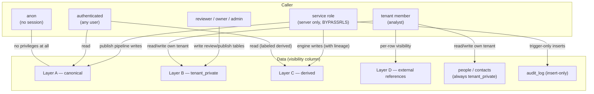

# Security Model — Life Science Nexus

| | |
|---|---|
| **Status** | RLS model shipped in migrations; live-DB verification pending (`docs/KNOWN_LIMITATIONS.md`) |
| **Date** | 2026-07-28 |
| **Sources of truth** | `supabase/migrations/20260727000009_rls.sql` (355 policies) · `src/lib/api/auth.ts` · `next.config.ts` |

Two enforcement layers, deliberately redundant: **database RLS** is the
backstop (Atlas's application-only authorization is the ecosystem's cautionary
tale — ADR 0001), and **application guards** shape what the UI/API even
attempts.

## RLS policy model

Deny by default. The `anon` role has **no privileges** on any public table
(revoked, including future default privileges). `authenticated` has table
grants; row access is governed entirely by policies. Helpers
`is_tenant_member(tenant_id)` and `has_tenant_role(tenant_id, roles)` are
`SECURITY DEFINER STABLE` with pinned `search_path` — safe against RLS
recursion on `tenant_memberships` itself.

| Table group | SELECT | INSERT / UPDATE / DELETE |
|---|---|---|
| Canonical-capable (70 tables) | `canonical` → all authenticated; `tenant_private` → tenant members | tenant-private rows only, role owner/admin/analyst |
| Review/publish (5 tables) | same as above | tenant-private rows, role owner/admin/reviewer |
| Tenant-scoped (37 tables) | tenant members | tenant members (one FOR ALL policy) |
| `tenants` | members | insert: any authenticated (onboarding); update: owner/admin |
| `profiles` | self + co-members | self only |
| `tenant_memberships` | members of the tenant | self-join or owner/admin |
| `api_clients`, `integration_connections` | members | owner/admin |
| `audit_log` | members (or platform entries) | **no write policies** — inserts only via the `SECURITY DEFINER` `touch_audit_log()` trigger; write grants revoked from authenticated |
| `price_observations` | canonical or member | append-only: no DELETE policy; trigger forbids updating `original_amount`/`original_currency`/`observation_date`; corrections via `supersedes_id` |

Structural invariants beneath the policies:

- Canonical rows have `tenant_id IS NULL`, so `has_tenant_role()` fails and
  tenant write policies never apply — **canonical writes are possible only
  through the service role** (`BYPASSRLS`), i.e. through the publish pipeline.
- `people`, `organization_contacts`, `contact_observations` carry
  `CHECK (visibility = 'tenant_private')` — PII cannot become canonical even
  by a privileged bug.
- The service-role key is server-only and never shipped to the browser.

## Data visibility matrix

| Layer / role | anon | authenticated | tenant member | reviewer | service role |
|---|---|---|---|---|---|
| A canonical | — | read | read | read | read + write (publish only) |
| B tenant-private | — | — | own tenant read/write (analyst+) | own tenant + review actions | all tenants |
| C derived | — | read | read | read | engine writes |
| D references | — | canonical refs | own tenant refs | — | all |
| people/contacts | — | — | own tenant only | own tenant only | all |
| audit_log | — | — | read own tenant | read | insert via trigger only |

## API security (API v1)

- **Auth** (`src/lib/api/auth.ts`): `x-api-key` header checked against
  `NEXUS_API_KEY`. When the env var is unset the API runs in demo mode (no
  key required, `mode: "demo"`). Tenant scoping via `x-nexus-tenant`; without
  it the caller is anonymous → canonical data only. This is API-key auth, not
  OAuth — the `ApiAuth` shape (tenantId + authenticated) is designed so JWT
  verification can replace the key check without touching handlers.
- **Rate limiting** (`src/lib/api/rate-limit.ts`): 60 req/min per
  (key, route), in-memory token bucket — per-instance, see
  `docs/KNOWN_LIMITATIONS.md`. 429 responses carry `Retry-After`;
  `X-RateLimit-Limit` / `X-RateLimit-Remaining` on success.
- **Error contract** (`src/lib/api/respond.ts`): `{ error: { code, message,
  details? } }`, stable codes over 400/401/404/422/429/500; handlers never
  leak stack traces (`withApi` catches and returns `internal_error`).
- **No service role in the browser**: `SUPABASE_SERVICE_ROLE_KEY` is read
  only by server code; the zod-validated `src/lib/env.ts` is server-only and
  client components receive the backend identity as props.
- **Input validation**: every body parsed with zod (`parseJsonBody`); unknown
  contract versions rejected by `z.literal` checks.

## Application-level guards

- **Exports** (`src/app/api/exports/[family]/route.ts` +
  `src/lib/api/exports.ts`): canonical rows always; `tenant_private` rows only
  when `includeTenantPrivate=true` **and** the caller is authenticated as that
  tenant (`canSeeTenantPrivate` in `src/lib/api/guards.ts`). The applied scope
  is recorded in the JSON payload and audit entry.
- **Handoffs** (`src/lib/api/memoire-handoff.ts`): every outbound payload
  carries a mandatory `visibilityWarning`; each build is logged as an
  `outbound_handoff_record`. Handoffs are disabled for demo sessions (ADR 0004).
- **Atlas surface**: `assertAtlasVendorNeutrality()`
  (`src/lib/integrations/atlas.ts`) strips price/equivalence/commercial fields
  from anything Atlas-bound and reports the stripped paths — see
  `docs/ATLAS_API.md`.

## HTTP & transport

`next.config.ts` sets on all routes: `X-Content-Type-Options: nosniff`,
`X-Frame-Options: DENY`, `Referrer-Policy: strict-origin-when-cross-origin`,
`Permissions-Policy: camera=(), microphone=(), geolocation=()`. Supabase
session refresh runs in `src/middleware.ts` (all non-static paths).

## Secret management

`.env.example` is the only committed env file; it contains names and comments,
never values. Server-only secrets: `SUPABASE_SERVICE_ROLE_KEY`,
`NEXUS_API_KEY`. Browser-safe: `NEXT_PUBLIC_SUPABASE_URL`,
`NEXT_PUBLIC_SUPABASE_ANON_KEY` (RLS is the enforcement, not key secrecy).
See `SECURITY.md` for reporting.

## Data deletion

Two stages, matching the schema:

1. **Archive (soft delete)** — `archiveEntity()` sets `archivedAt`; the row
   stays retrievable by id and restorable, and is excluded from list/search
   paths. This is the user-facing delete.
2. **Hard delete** — service-role/SQL only, after archive:
   - single record: `DELETE` on the archived row (respecting FK order);
   - demo purge: scoped by `is_demo = true` / `tenant_demo` (ADR 0004 cleanup
     path — one scoped query before the first real tenant onboards);
   - tenant offboarding: delete `tenant_private` rows by `tenant_id`, then
     the memberships and tenant. `audit_log` entries are retained (append-only
     by design); `price_observations` are never hard-deleted — they are
     `superseded`, preserving the evidence ledger.

## Verification

| Check | Command | Needs live DB |
|---|---|---|
| Structural migration gate | `npm run verify:evidence` | no |
| Demo-separation assertions | `npm run verify:demo-separation` | no |
| RLS enabled everywhere, anon revoked, policy spot-checks | `npm run verify:rls` | yes |
| Cross-tenant isolation proof | `npm run verify:data-isolation` | yes |

The two live-DB scripts require `DATABASE_URL` (direct connection string) and
demo auth users for the isolation proof — see `docs/DATABASE.md` §Verification.
